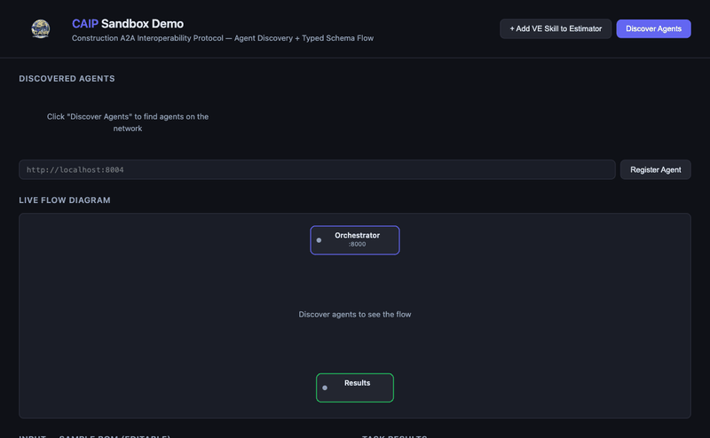

<p align="center">
  
</p>

# TACO — The A2A Construction Open-standard

**An open standard for AI agent communication in the built environment.**

TACO is a construction-specific ontology layer built on top of the [A2A protocol](https://a2a-protocol.org) (Linux Foundation). It defines a shared vocabulary of task types, typed data schemas, and agent discovery extensions so that AI agents across the construction industry can interoperate — regardless of who built them.

Every TACO agent is a standard A2A agent. Zero lock-in.

---

## What TACO Adds

| Layer | What it defines | Example |
|-------|----------------|---------|
| **Task Types** | A typed vocabulary of construction workflows | `takeoff`, `estimate`, `rfi-generation`, `submittal-review`, `schedule-coordination` |
| **Data Schemas** | Typed JSON schemas for construction artifacts | `bom-v1`, `rfi-v1`, `estimate-v1`, `schedule-v1`, `quote-v1` |
| **Agent Discovery** | Construction extensions to A2A Agent Cards | Filter by trade, CSI division, project type, file format, platform integration |
| **Security** | Scope taxonomy, trust tiers, token delegation | `taco:trade:mechanical`, `taco:task:estimate`, `taco:project:PRJ-0042:write` |

## How It Works

```
┌──────────────┐    ┌──────────────┐    ┌──────────────┐    ┌──────────────┐
│  Takeoff     │───▶│  Estimating  │───▶│  Supplier    │───▶│  Bid Package │
│  Agent       │    │  Agent       │    │  Agent       │    │  (complete)  │
└──────┬───────┘    └──────┬───────┘    └──────┬───────┘    └──────────────┘
       │ bom-v1            │ estimate-v1       │ quote-v1
       ▼                   ▼                   ▼
╔══════════════════════════════════════════════════════════════════════════╗
║  TACO — shared task types, data schemas, agent discovery               ║
╚══════════════════════════════════════════════════════════════════════════╝
       ▲                   ▲                   ▲
       │ schedule-v1       │ rfi-v1            │
┌──────┴───────┐    ┌──────┴───────┐    ┌──────────────┐
│  Schedule    │    │  RFI Agent   │    │  Architect   │
│  Agent       │    │              │    │  Agent       │
└──────────────┘    └──────────────┘    └──────────────┘
```

Different companies. Different AI models. One shared language.

## Sandbox Demo

The repo includes a fully functional demo with 3 LLM-powered agents, an orchestrator dashboard, and a live flow diagram.

<p align="center">
  
</p>

**Run it yourself:**

```bash
# Clone and configure
git clone https://github.com/pelles-ai/taco.git && cd taco
cp examples/.env.example examples/.env
# Edit examples/.env and add your API key (Anthropic or OpenAI)

# Run with Docker (recommended)
make demo-docker

# Or run locally
make demo-install && make demo
```

Then open [http://localhost:8000](http://localhost:8000), click **Discover Agents**, and send tasks to see typed schemas flow between independent agents in real time.

## Repository Structure

```
taco/
├── Makefile                         # demo, demo-docker, demo-stop
├── spec/                            # Protocol specification
│   ├── task-types.md                # Construction task type definitions
│   ├── agent-card-extensions.md     # x-construction Agent Card fields
│   ├── security.md                  # Auth model, scope taxonomy, trust tiers
│   └── schemas/                     # JSON Schema definitions (bom-v1, rfi-v1, estimate-v1, ...)
├── sdk/                             # Reference SDK (Python)
│   └── taco/                        # models, schemas, server, agent_card, registry, client
├── website/                         # Docusaurus documentation site
│   ├── docs/                        # Markdown documentation pages
│   ├── src/                         # Landing page and components
│   └── static/                      # Visual reference diagrams (HTML)
└── examples/                        # Sandbox demo
    ├── docker-compose.yml           # 4 services, hot-reload
    ├── run_demo.py                  # Local launcher (all 4 processes)
    ├── common/                      # Shared A2A server, models, LLM provider
    ├── agents/                      # 3 LLM-powered TACO agents
    │   ├── estimating_agent.py      # :8001 — estimate + value-engineering
    │   ├── supplier_quote_agent.py  # :8002 — material-procurement
    │   └── rfi_generation_agent.py  # :8003 — rfi-generation
    └── orchestrator/                # :8000 — dashboard + agent discovery
        ├── app.py
        └── dashboard.html           # Single-file UI with live flow diagram
```

## Quick Start

```bash
pip install taco-agent
```

```python
from taco import ConstructionAgentCard, ConstructionSkill

# Define your agent
card = ConstructionAgentCard(
    name="My Electrical Estimating Agent",
    trade="electrical",
    csi_divisions=["26"],
    skills=[
        ConstructionSkill(
            id="generate-estimate",
            task_type="estimate",
            input_schema="bom-v1",
            output_schema="estimate-v1",
        )
    ],
)

# Serve as an A2A-compatible endpoint
card.serve(host="0.0.0.0", port=8080)
```

```python
from taco import TacoClient, extract_structured_data

# Send a task to an agent
async with TacoClient(agent_url="http://localhost:8001") as client:
    card = await client.discover()
    task = await client.send_message("estimate", bom)
    estimate = extract_structured_data(task.artifacts[0].parts[0])
    # estimate follows the estimate-v1 schema
```

```python
from taco import AgentRegistry

# Discover and filter agents in-memory
registry = AgentRegistry()
await registry.register("http://localhost:8001")
await registry.register("http://localhost:8002")
agents = registry.find(trade="plumbing", task_type="material-procurement")
```

> **Note:** The Python SDK uses snake_case parameter names (e.g., `csi_divisions`, `task_type`) that map to the camelCase JSON fields defined in the spec (`csiDivisions`, `taskType`).

## Documentation

Full documentation is hosted at [pelles-ai.github.io/taco](https://pelles-ai.github.io/taco/):

- [Introduction](https://pelles-ai.github.io/taco/docs/intro)
- [Task Types](https://pelles-ai.github.io/taco/docs/task-types)
- [Agent Card Extensions](https://pelles-ai.github.io/taco/docs/agent-card-extensions)
- [Data Schemas](https://pelles-ai.github.io/taco/docs/schemas/)
- [SDK Reference](https://pelles-ai.github.io/taco/docs/sdk)
- [Security](https://pelles-ai.github.io/taco/docs/security)

## Principles

1. **Ontology, not protocol.** TACO builds on A2A using its native extension points. Every TACO agent is a standard A2A agent.
2. **Agents are opaque.** Agents collaborate without exposing internals — proprietary logic, pricing models, and trade secrets stay private.
3. **Open and composable.** Apache 2.0 licensed. The spec, schemas, and SDK are open source. The registry is a shared resource.
4. **Construction-native.** Task types, schemas, and discovery are designed for how construction actually works — by trade, CSI division, project phase, and platform.

## Status

🚧 **Early stage** — We're defining the core schemas and building the reference SDK. Looking for construction technology companies, trade contractors, GCs, and platform vendors to help shape the standard.

## Get Involved

- **GitHub Discussions**: Share ideas and feedback
- **Issues**: Report problems or suggest improvements
- **Contributing**: See [CONTRIBUTING.md](CONTRIBUTING.md)

## License

Apache 2.0 — see [LICENSE](LICENSE).

---

*Initiated by [Pelles](https://pelles.ai). Built on the [A2A protocol](https://a2a-protocol.org) (Linux Foundation).*
