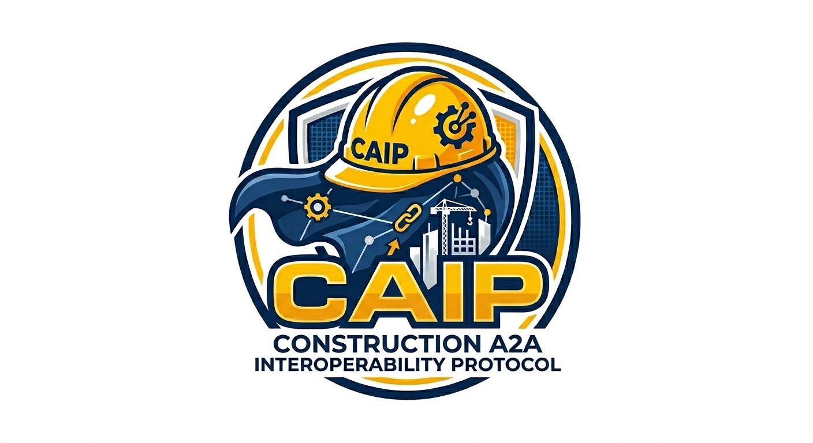

<p align="center">
  
</p>

# CAIP — Construction A2A Interoperability Protocol

**An open standard for AI agent communication in the built environment.**

CAIP is a construction-specific ontology layer built on top of the [A2A protocol](https://a2a-protocol.org) (Linux Foundation). It defines a shared vocabulary of task types, typed data schemas, and agent discovery extensions so that AI agents across the construction industry can interoperate — regardless of who built them.

Every CAIP agent is a standard A2A agent. Zero lock-in.

---

## What CAIP Adds

| Layer | What it defines | Example |
|-------|----------------|---------|
| **Task Types** | A typed vocabulary of construction workflows | `takeoff`, `estimate`, `rfi-generation`, `submittal-review`, `schedule-coordination` |
| **Data Schemas** | Typed JSON schemas for construction artifacts | `bom-v1`, `rfi-v1`, `estimate-v1`, `schedule-v1`, `quote-v1` |
| **Agent Discovery** | Construction extensions to A2A Agent Cards | Filter by trade, CSI division, project type, file format, platform integration |

## How It Works

```
┌──────────────┐    ┌──────────────┐    ┌──────────────┐    ┌──────────────┐
│  Takeoff     │───▶│  Estimating  │───▶│  Supplier    │───▶│  Bid Package │
│  Agent       │    │  Agent       │    │  Agent       │    │  (complete)  │
└──────┬───────┘    └──────┬───────┘    └──────┬───────┘    └──────────────┘
       │ bom-v1            │ estimate-v1       │ quote-v1
       ▼                   ▼                   ▼
╔══════════════════════════════════════════════════════════════════════════╗
║  CAIP — shared task types, data schemas, agent discovery               ║
╚══════════════════════════════════════════════════════════════════════════╝
       ▲                   ▲                   ▲
       │ schedule-v1       │ rfi-v1            │
┌──────┴───────┐    ┌──────┴───────┐    ┌──────────────┐
│  Schedule    │    │  RFI Agent   │    │  Architect   │
│  Agent       │    │              │    │  Agent       │
└──────────────┘    └──────────────┘    └──────────────┘
```

Different companies. Different AI models. One shared language.

## Repository Structure

```
caip/
├── README.md
├── CONTRIBUTING.md
├── LICENSE                          # Apache 2.0
├── assets/
│   └── caip_logo.png
├── docs/
│   ├── abstract.md                  # Project abstract
│   ├── DIAGRAM_PROMPT.md            # Prompt for generating architecture diagrams
│   ├── caip-architecture-overview.html
│   └── caip-workflow-composition.html
├── spec/
│   ├── task-types.md                # Construction task type definitions
│   ├── agent-card-extensions.md     # x-construction Agent Card fields
│   └── schemas/                     # JSON Schema definitions
│       ├── bom-v1.json
│       ├── rfi-v1.json
│       ├── estimate-v1.json
│       ├── schedule-v1.json
│       ├── quote-v1.json
│       └── change-order-v1.json
└── sdk/                             # Reference SDK (Python)
    ├── pyproject.toml
    └── caip/
        ├── __init__.py
        ├── agent_card.py
        ├── schemas.py
        ├── registry.py
        └── client.py
```

## Quick Start

```python
from caip import ConstructionAgentCard, ConstructionSkill

# Define your agent
card = ConstructionAgentCard(
    name="My Electrical Estimating Agent",
    trade="electrical",
    csi_divisions=["26"],
    skills=[
        ConstructionSkill(
            id="generate-estimate",
            task_type="estimate",
            input_schema="bom-v1",
            output_schema="estimate-v1",
        )
    ],
)

# Serve as an A2A-compatible endpoint
card.serve(host="0.0.0.0", port=8080)
```

```python
from caip import AgentRegistry

# Discover agents
registry = AgentRegistry(url="https://registry.caip.dev")
agents = registry.find(trade="plumbing", task_type="material-procurement")

# Delegate a task
result = await agents[0].run_task(
    task_type="material-procurement",
    input=bom,
)
# result.schema == "quote-v1"
```

> **Note:** The Python SDK uses snake_case parameter names (e.g., `csi_divisions`, `task_type`) that map to the camelCase JSON fields defined in the spec (`csiDivisions`, `taskType`).

## Principles

1. **Ontology, not protocol.** CAIP builds on A2A using its native extension points. Every CAIP agent is a standard A2A agent.
2. **Agents are opaque.** Agents collaborate without exposing internals — proprietary logic, pricing models, and trade secrets stay private.
3. **Open and composable.** Apache 2.0 licensed. The spec, schemas, and SDK are open source. The registry is a shared resource.
4. **Construction-native.** Task types, schemas, and discovery are designed for how construction actually works — by trade, CSI division, project phase, and platform.

## Status

🚧 **Early stage** — We're defining the core schemas and building the reference SDK. Looking for construction technology companies, trade contractors, GCs, and platform vendors to help shape the standard.

## Get Involved

- **GitHub Discussions**: Share ideas and feedback
- **Issues**: Report problems or suggest improvements
- **Contributing**: See [CONTRIBUTING.md](CONTRIBUTING.md)

## License

Apache 2.0 — see [LICENSE](LICENSE).

---

*Initiated by [Pelles](https://pelles.ai). Built on the [A2A protocol](https://a2a-protocol.org) (Linux Foundation).*
